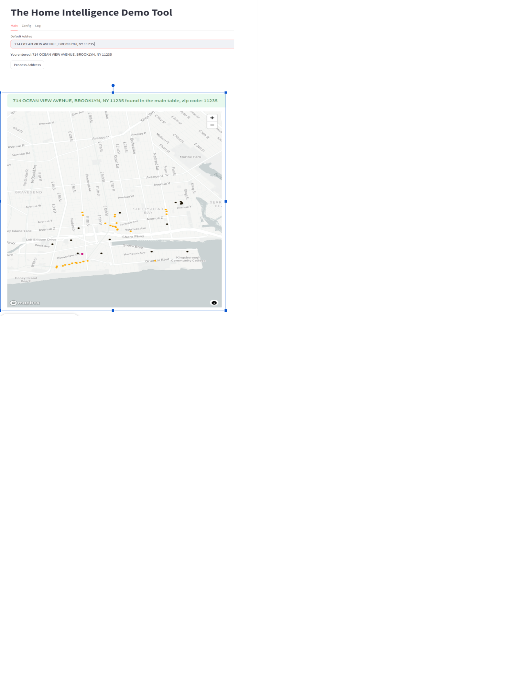

## mvp_926

I am sharing:  
* 4 address tables: MN, NJ, MS, CA;  
* 2 FEC tables, containing data about donations of years 2019 and 2020\. These tables are big but we are interested only in a small subset of its fields, which I highlighted:  

The standard USA Ppost address record includes the following fields:

* Name (usual 4 subfields for prefix, first, middle, last name, in the context of MVP we do not care)  
* Street Number  
* Street Name  
* Unit (apartment number or some other orientational ID)  
* City name  
* State name as a code  
* Zip code (it can be 5 or 9 characters, in the context of MVP we will use 5\)

Thus the 4 address tables that I share have these fields and some additions: district and geom.

**NUMBER,STREET,UNIT,CITY,DISTRICT,REGION,POSTCODE,GEOM**

1017,550TH ST,,,,MN,56297-1428,SRID=4326;POINT(-95.5446687 44.5452237)

5974,100TH AVE,,,,MN,56292-1400,SRID=4326;POINT(-95.4480118 44.5434116)

1024,540TH ST,,,,MN,56297-1438,SRID=4326;POINT(-95.5623666 44.5465171)

You can ignore the field DISTRICT but use GEOM, the last column, for it holds coordinates that are used for geospatial visualization  (show the address point on a map).  

FEC tables have the following structure:  

**CONTBR\_ID** | **CONTBR\_NM\_FIRST  | CONTBR\_NM\_LAST | CONTBR\_ST1 | CONTBR\_ST2 | CONTBR\_CITY | CONTBR\_ST | CONTBR\_ZIP | CONTB\_RECEIPT\_AMT**

\-----------+------------------+----------------+-------------------------------+------------+-------------+-----------+------------+-------------------

&nbsp;| BAMBI            | POLK           | 2212 BRIGHAM STREET APT 4F    |            | BROOKLYN    | NY        | 11229      |             30.00

&nbsp;| DEBORAH          | LERNER         | 2300 OCEAN AVE 4A             |            | BROOKLYN    | NY        | 11229      |              1.00

&nbsp;| SHIRLEY          | RITENOUR       | 3165 NOSTRAND AVE APT 6E      |            | BROOKLYN    | NY        | 11229      |              5.00

&nbsp;| LORI             | JACOBS         | 2229 KNAPP STREET APT 5A      |            | BROOKLYN    | NY        | 11229      |             25.00

&nbsp;| BAMBI            | POLK           | 2212 BRIGHAM STREET APT 4F    |            | BROOKLYN    | NY        | 11229      |             25.00

&nbsp;| ANNE             | OHANA          | 2147 EAST 17TH STREET         |            | BROOKLYN    | NY        | 11229      |              3.00

&nbsp;| HELEN            | CHRISTOPHER    | 8 EBONY COURT                 |            | BROOKLYN    | NY        | 11229      |             15.00

&nbsp;| DIANNE           | RAUCH          | 1718 QUENTIN ROAD APT 3F      |            | BROOKLYN    | NY        | 11229      |              9.00

&nbsp;| YANKAU JOSEPHINE | WONG           | 2042 BRAGG ST                 |            | BROOKLYN    | NY        | 11229      |              3.00

&nbsp;| ALICIA           | PHILLIPS       | 1724 MADISON PLACE            |            | BROOKLYN    | NY        | 11229      |              5.00

Notice that in this table the address structure is structured differently: cntbr\_st1 includes a street number, a street name  and a unit, the field cntbr\_st2 is often but not always empty, and the next three fields are in accord with the post standard.  

There are two example of FEC tables:  
* fec_2020_10000.csv  
* fec_2021_10000.csv  

I suggest that we implement an MVP of SPA that will able to do the following:

* open the face page with some user welcome, and an address entry form with Enter and Clear/Reset;  
* upon click of the Enter the FA does some quick address check and if the entered string feels like a valid address (above) makes a request to the BE;  
  BE uses entered address string to query the state address tables to find the address geom, and the fec table to find whether the address made a donation in 2020;&nbsp;  
* if BE finds neither geom nor donation the FE displays “Address Not Found” message;  
*  if BE finds geom the FE should display a map with the entered address (see images below);&nbsp;  
*  if BE finds a donation as well the FE displays something like “An Amount of $1.00 Ha Been Donated from {address}”;  
  
We probably can add this something like:

* get the shape of this Zip parcel on a map;  
* get the total $$$ donated from this Zip from this city, from this state;  
* get a bell curve of donations from t\\made in202 from this zip, city, state;

Later this week I will add to the repository a small GUI program that models what I suggest to implement. You can wait for me or start when you like.  

The image model.png is a primitive model of a possible FE look:

